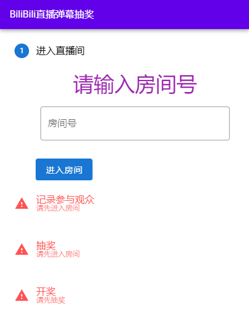

# Bilibili Live Lottery


Bilibili直播弹幕抽奖



## :bookmark_tabs:内容列表

- [背景](#背景)
- [安装](#安装)
- [使用说明](#使用说明)
- [使用许可](#使用许可)

## :triangular_flag_on_post:背景

许多主播在直播抽奖时都是通过截图来抽奖的，而我从没中过，想来想去越想越气，这肯定是因为截图这种方法不公平！

于是就有了这个项目……

(然而我还是没中过)

## :hourglass:安装

- 使用 yarn

```shell
yarn install
```

- 使用 npm

```shell
npm install	
```


## :bell:使用说明

1. 输入房间号后点击 `进入房间` 按钮开始记录发送弹幕的观众 uid 和昵称，不会重复记录。
2. 点击 `停止记录` 按钮后停止记录弹幕。
3. 填入需要抽取的人数(小于等于刚才记录的总人数)
4. 点击 `随机抽奖` 按钮在刚才记录过程中所有发送弹幕的观众里面随机抽取指定数量观众。
5. 点击中奖观众的用户名可跳转到该观众的B站主页，方便私信。

## :page_with_curl:使用许可

[WTFPL](LICENSE) :copyright: kdxcxs